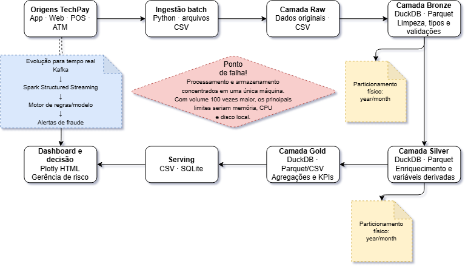

# Justificativa da Arquitetura de Dados

## 1. Visão geral da arquitetura

A arquitetura proposta para a TechPay organiza o processamento das transações financeiras em camadas, seguindo o modelo de dados Raw, Bronze, Silver e Gold. O objetivo é preservar os dados originais, garantir qualidade e rastreabilidade durante as transformações e disponibilizar informações consolidadas para análise de risco de fraude e tomada de decisão.

As transações originadas nos canais aplicativo, web, ponto de venda (POS) e caixa eletrônico (ATM) são recebidas em arquivos CSV por meio de uma ingestão batch desenvolvida em Python. Os dados passam pelas camadas de armazenamento e transformação até a produção de indicadores consolidados, que são disponibilizados em arquivos CSV, banco SQLite e dashboard interativo em Plotly.

## 2. Escolha da ferramenta de ingestão

Python foi escolhido para realizar a ingestão batch por ser uma tecnologia flexível, amplamente utilizada em projetos de dados e adequada ao volume utilizado neste trabalho. A linguagem permite automatizar a leitura dos arquivos CSV, validar sua estrutura, controlar duplicidades, registrar a quantidade de linhas processadas e direcionar os dados para as camadas seguintes.

Além disso, Python possui integração com as principais ferramentas utilizadas no projeto, como Pandas, PyArrow, DuckDB, SQLite e PySpark. Isso reduz a complexidade da solução e permite que todo o pipeline seja executado no ambiente local utilizado na disciplina.

Em um ambiente corporativo, uma alternativa seria utilizar o Apache NiFi para organizar e monitorar os fluxos de ingestão. Outra possibilidade seria o Apache Airflow, responsável pelo agendamento, pela dependência entre tarefas, pelas tentativas automáticas em caso de falha e pelo registro da execução do pipeline. Para dados em tempo real, o Apache Kafka seria mais adequado, pois possibilitaria a recepção contínua dos eventos gerados pelos diferentes canais da TechPay.

## 3. Estratégia de particionamento

Os dados das camadas Bronze e Silver foram armazenados em formato Parquet e particionados fisicamente pelas colunas `year` e `month`, derivadas da data da transação. Essa estratégia organiza os arquivos por períodos e permite que o mecanismo de consulta leia somente as partições necessárias.

Por exemplo, em uma análise das transações ocorridas em março de 2024, o mecanismo pode acessar apenas a partição correspondente a `year=2024/month=3`, em vez de percorrer todos os dados de 2023 e 2024. Isso reduz a quantidade de dados lidos, o consumo de recursos computacionais e o tempo de resposta das consultas.

O particionamento mensal foi escolhido por representar um equilíbrio entre desempenho e quantidade de arquivos. Uma divisão diária poderia produzir muitas partições pequenas, enquanto uma divisão somente anual exigiria a leitura de um volume maior de dados nas consultas mensais. A estratégia também é compatível com análises financeiras e de fraude realizadas por mês, trimestre ou ano.

## 4. Camadas de dados

A camada Raw preserva os arquivos exatamente como foram recebidos, sem alteração dos valores originais. Essa conservação permite rastrear a origem dos dados e reprocessar o pipeline caso alguma regra de negócio seja alterada.

Na camada Bronze, os dados passam por verificações iniciais, padronização dos tipos das colunas e validações de qualidade. Nessa etapa são avaliados registros duplicados, campos obrigatórios, datas inválidas, valores inconsistentes e identificadores ausentes.

Na camada Silver, os dados são enriquecidos e preparados para análise. As transações são integradas aos dados dos clientes e às informações de fraude. Também são criadas variáveis derivadas, como ano, mês, dia da semana, período do dia e segmentações utilizadas nas análises.

A camada Gold reúne dados agregados e indicadores de negócio, como quantidade de transações, número de fraudes, taxa de fraude, ticket médio e valor financeiro em risco. Os resultados são disponibilizados para consumo em arquivos CSV e tabelas SQLite e utilizados na construção do dashboard gerencial.

## 5. Limitações com o aumento do volume

Se o volume de dados aumentasse cem vezes, o principal ponto de falha seria a concentração do processamento e do armazenamento em uma única máquina. O ambiente local ficaria limitado pela memória RAM, pela capacidade da CPU, pelo espaço em disco e pela velocidade de leitura e escrita dos arquivos.

A utilização de Pandas também poderia se tornar inviável, porque parte relevante dos dados precisa ser carregada na memória. O DuckDB consegue processar volumes maiores de maneira eficiente, mas continuaria limitado aos recursos do computador local. A existência de muitos arquivos pequenos também poderia aumentar o tempo de leitura e o custo de gerenciamento das partições.

Para suportar esse crescimento, a arquitetura poderia ser migrada para um ambiente distribuído. O armazenamento seria realizado em um data lake, utilizando tecnologias como HDFS ou armazenamento de objetos em nuvem. O processamento poderia ser executado com Apache Spark em um cluster, distribuindo os dados e as tarefas entre diferentes máquinas. Também seriam necessários mecanismos de orquestração, monitoramento, controle de qualidade, compactação e tratamento adequado dos arquivos pequenos.

## 6. Evolução para detecção de fraude em tempo real

O pipeline desenvolvido trabalha principalmente em modo batch, sendo adequado para análises históricas, geração de indicadores e atualização periódica do dashboard. Entretanto, a detecção operacional de fraude exige que as transações sejam avaliadas com baixa latência, antes ou imediatamente após sua autorização.

Nesse cenário, os canais da TechPay publicariam cada nova transação em um tópico do Apache Kafka. O Spark Structured Streaming consumiria continuamente esses eventos e aplicaria regras de negócio ou um modelo de classificação de fraude. As transações consideradas suspeitas poderiam gerar alertas para uma equipe especializada ou ser encaminhadas para uma etapa adicional de autenticação.

O resultado do processamento em tempo real também seria enviado ao dashboard e armazenado nas camadas históricas do data lake. Dessa forma, a arquitetura manteria dois fluxos complementares: o fluxo streaming, responsável por decisões imediatas, e o fluxo batch, utilizado para análises históricas, auditoria, atualização dos indicadores e treinamento periódico dos modelos.

## 7. Conclusão

A arquitetura proposta atende ao objetivo acadêmico do projeto e demonstra as principais etapas de um pipeline de Big Data: ingestão, armazenamento em camadas, tratamento, enriquecimento, agregação e disponibilização dos resultados. A utilização de Python, DuckDB, Parquet, PySpark, SQLite e Plotly possibilitou a construção de uma solução reproduzível no ambiente local.

Embora a solução atual seja suficiente para o conjunto de dados analisado, o desenho permite identificar sua evolução para um cenário corporativo. Com o aumento do volume ou a necessidade de decisões em tempo real, o armazenamento distribuído, o Apache Spark e o Apache Kafka passariam a desempenhar papéis centrais na escalabilidade e na redução da latência do processamento.